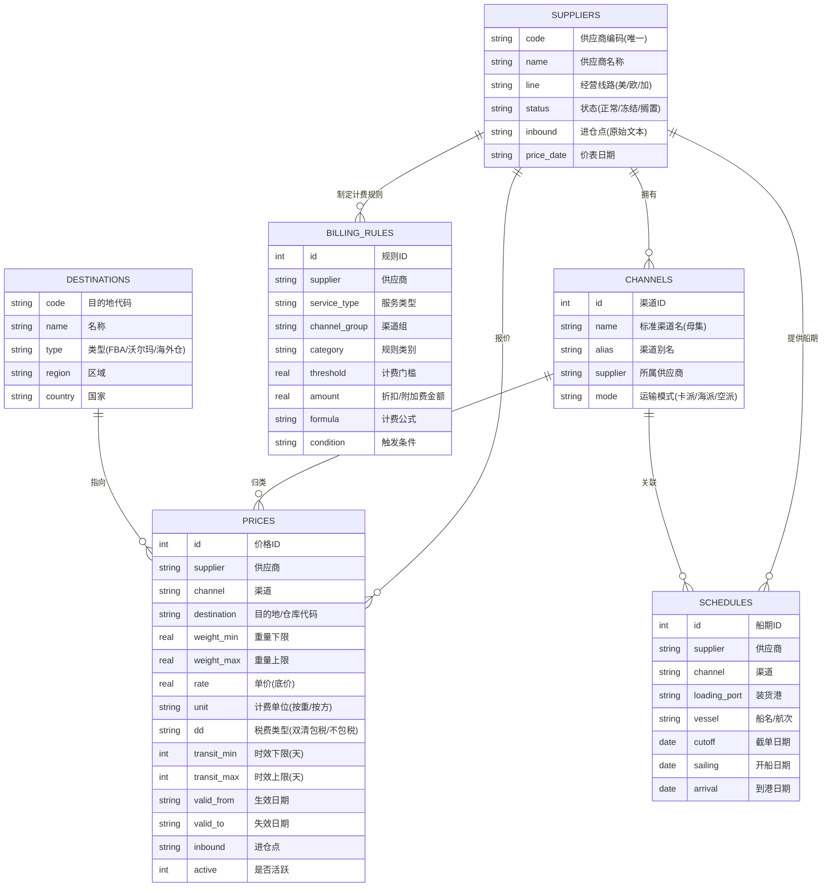

# 数据库 ER 图与表结构设计

> 系统采用轻量级 SQLite 存储，按「生产 / 测试 / 档案」三库分离管理，价格数据按线路分表（美线 / 欧线 / 加拿大线），从根上避免跨线路脏数据。

## 1. ER 图（Mermaid）

## 2. 核心实体与关系说明

| 实体 | 职责 | 关键设计 |
|:--|:--|:--|
| 供应商 | 货源主数据 | 一供应商多渠道、多报价、多船期、多规则 |
| 渠道 | 标准归类（母集） | 把供应商五花八门的渠道名统一归并到标准大类 |
| 价格 | 四维报价 | 供应商 × 渠道 × 仓库 × 重量段，锁定唯一底价 |
| 船期 | 截单/开船/到港 | 支持周模式动态推算，应对供应商只给「每周 X 截 Y 开」 |
| 计费规则 | 附加费/折扣 | 比重优惠、尺寸附加、报关费等逐条核 |
| 目的地 | FBA / 沃尔玛 / 海外仓 | 白名单校验，杜绝非法仓码入库 |

## 3. 关系说明

1. **供应商 → 渠道（1:N）**：一家供应商拥有多个渠道，渠道按母集标准归类。
2. **供应商 / 渠道 → 价格（1:N）**：价格同时关联供应商与渠道，形成「供应商 × 渠道 × 仓库 × 重量段」四维报价。
3. **目的地 → 价格（1:N）**：价格指向具体目的地（FBA 仓库代码）。
4. **供应商 → 船期（1:N）**：船期由供应商提供，关联到具体渠道。
5. **供应商 → 计费规则（1:N）**：计费规则按「供应商 + 服务类型 + 渠道组 + 类别」四维锁定。

## 4. 设计要点

- **三库分离**：生产库（只读报价）/ 测试库（技能产出）/ 档案库（趋势历史），旧数据归档后去除时效与规则字段，仅留趋势用。
- **分线路分表**：美线 / 欧线 / 加拿大线物理隔离，禁止跨线路查询。
- **原始名保真**：渠道原始名与进仓点保留 Excel 原文，报价可溯源到原始价表。
- **底价原则**：报价引擎只读数据库原始底价，禁止任何形式加价——这是「宁可不报价、不可报错价」的数据根基。
