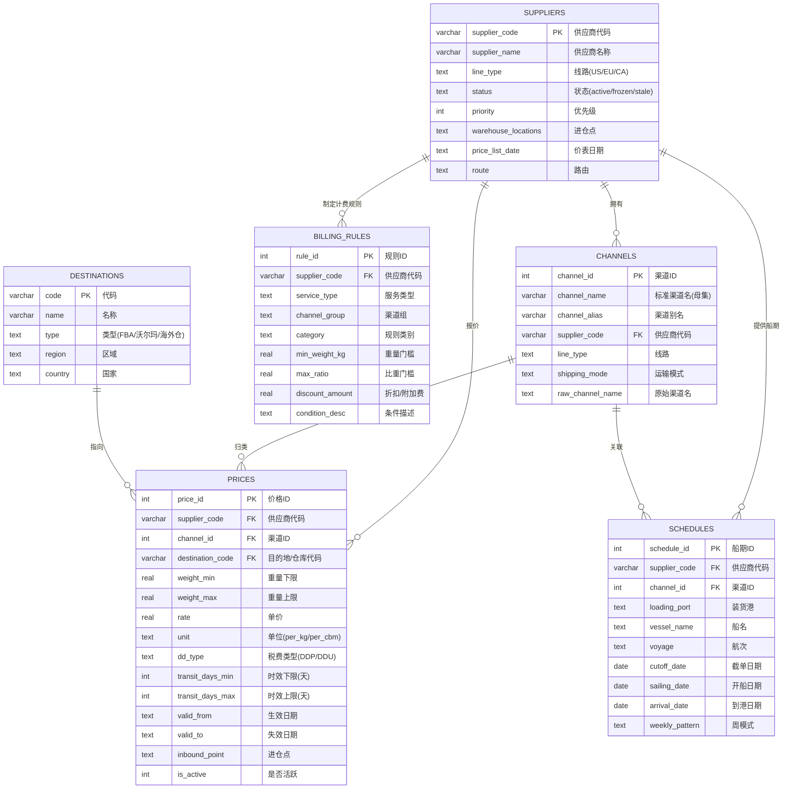

# 数据库 ER 图与表结构设计

> 生产库采用 SQLite，三库分离（生产 / 测试 / 档案），价格表按线路分表（美线 / 欧线 / 加拿大线）。

## 1. ER 图（Mermaid）

## 2. 核心表字段说明

### 2.1 suppliers — 供应商主数据

| 字段 | 类型 | 说明 |
|:---|:---|:---|
| supplier_code | VARCHAR(10) PK | 供应商代码（唯一标识） |
| supplier_name | VARCHAR(50) | 供应商名称 |
| line_type | TEXT | 经营线路（US/EU/CA） |
| status | TEXT | 状态：active / frozen / stale |
| warehouse_locations | TEXT | 进仓点（原始文本，如"义乌/宁波"） |
| price_list_date | TEXT | 最新价表日期 |
| route | TEXT | 路由标记 |

### 2.2 channels — 渠道（母集标准）

| 字段 | 类型 | 说明 |
|:---|:---|:---|
| channel_id | INTEGER PK | 渠道 ID |
| channel_name | VARCHAR | 标准渠道名（母集，如"美森CLX正班"） |
| channel_alias | VARCHAR | 别名 |
| supplier_code | VARCHAR | 所属供应商 |
| raw_channel_name | TEXT | 供应商原始渠道名（保真） |
| shipping_mode | TEXT | 卡派 / 海派 / 空派 |

### 2.3 prices / prices_eu / prices_ca — 价格（分线路）

> 三表结构一致，按线路物理隔离，禁止跨线路查询。

| 字段 | 类型 | 说明 |
|:---|:---|:---|
| price_id | INTEGER PK | 价格 ID |
| supplier_code | VARCHAR FK | 供应商 |
| channel_id | INTEGER FK | 渠道 |
| destination_code | VARCHAR FK | 目的地（FBA 仓码） |
| weight_min / weight_max | REAL | 重量档位区间 |
| rate | REAL | 单价（底价） |
| unit | TEXT | per_kg / per_cbm |
| dd_type | TEXT | DDP / DDU |
| transit_days_min / max | INTEGER | 入仓时效（天） |
| valid_from / valid_to | TEXT | 价表有效期 |
| inbound_point | TEXT | 进仓点（原始文本） |
| is_active | INTEGER | 是否活跃（0=归档） |

### 2.4 schedules — 船期

| 字段 | 类型 | 说明 |
|:---|:---|:---|
| schedule_id | INTEGER PK | 船期 ID |
| supplier_code / channel_id | FK | 供应商 / 渠道 |
| cutoff_date / sailing_date | DATE | 截单 / 开船日期 |
| arrival_date | DATE | 到港日期 |
| vessel_name / voyage | TEXT | 船名 / 航次 |
| weekly_pattern | TEXT | 周模式（用于动态推算日期） |

### 2.5 billing_rules — 计费规则

| 字段 | 类型 | 说明 |
|:---|:---|:---|
| rule_id | INTEGER PK | 规则 ID |
| supplier_code | VARCHAR FK | 供应商 |
| category | TEXT | 比重优惠 / 尺寸附加 / 报关费 / 附加费 / 按方计费 |
| min_weight_kg / max_ratio | REAL | 计费门槛 |
| discount_amount | REAL | 折扣或附加费金额 |
| cost_formula | TEXT | 计费公式 |

## 3. 关系说明

1. **suppliers → channels（1:N）**：一家供应商拥有多个渠道，渠道按母集标准归类。
2. **suppliers / channels → prices（1:N）**：价格记录同时关联供应商与渠道，形成「供应商 × 渠道 × 仓库 × 重量段」四维报价。
3. **destinations → prices（1:N）**：价格指向具体目的地（FBA 仓库代码）。
4. **suppliers → schedules（1:N）**：船期由供应商提供，关联到具体渠道。
5. **suppliers → billing_rules（1:N）**：计费规则按「供应商 + 服务类型 + 渠道组 + 类别」四维锁定。

## 4. 设计要点

- **三库分离**：生产库（只读报价）/ 测试库（技能产出）/ 档案库（趋势图历史），旧数据归档最多保留 4 周。
- **分线路分表**：prices / prices_eu / prices_ca 物理隔离，避免跨线路脏数据。
- **原始名保真**：`raw_channel_name`、`inbound_point` 保留 Excel 原始文本，查询时通过别名反向展开。
- **底价原则**：报价引擎只读数据库原始底价，禁止任何形式加价。
