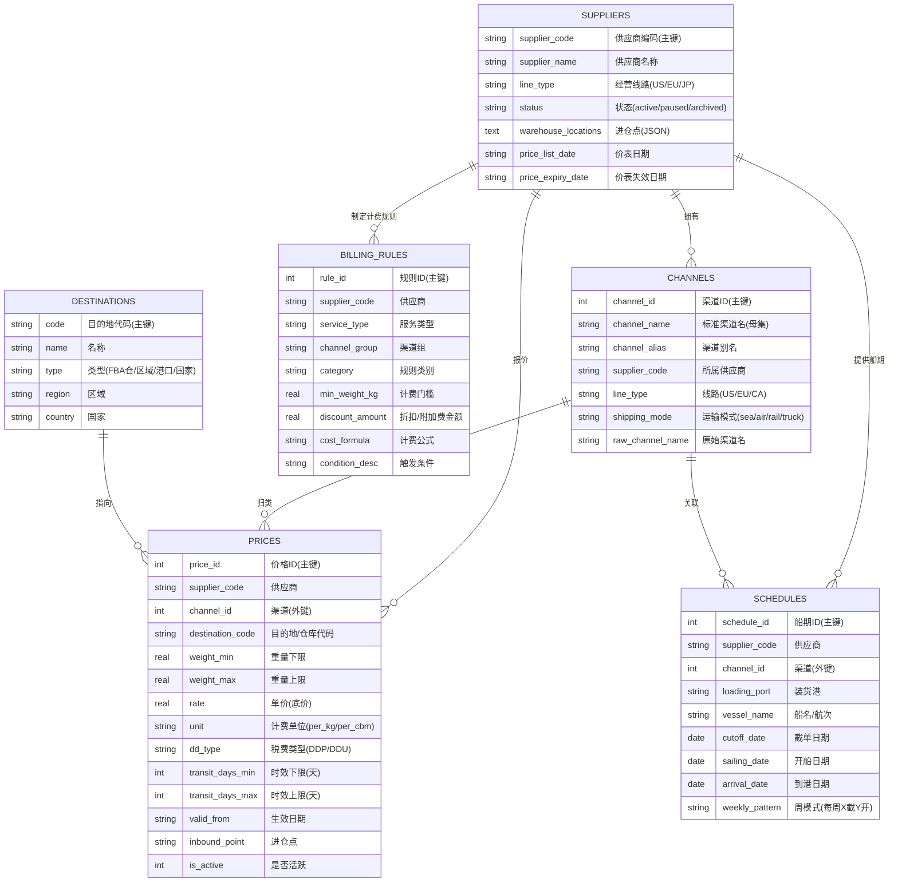

# 数据库 ER 图与表结构设计

> 系统采用轻量级 SQLite 存储，按「生产 / 测试 / 档案」三库分离管理，价格数据按线路分表（美线 `prices` / 欧线 `prices_eu` / 加拿大线 `prices_ca`），从根上避免跨线路脏数据。
> 以下表结构与字段均来自生产库真实 schema，可溯源。

## 1. ER 图（Mermaid）

## 2. 核心实体与关系说明

| 实体 | 职责 | 关键设计 |
|:--|:--|:--|
| 供应商 | 货源主数据 | 一供应商多渠道、多报价、多船期、多规则 |
| 渠道 | 标准归类（母集） | 把供应商五花八门的渠道名统一归并到标准大类 |
| 价格 | 四维报价 | 供应商 × 渠道 × 仓库 × 重量段，锁定唯一底价 |
| 船期 | 截单/开船/到港 | 支持周模式动态推算，应对供应商只给「每周 X 截 Y 开」 |
| 计费规则 | 附加费/折扣 | 比重优惠、尺寸附加、报关费等逐条核 |
| 目的地 | FBA / 区域 / 港口 / 国家 | 白名单校验，杜绝非法仓码入库 |

## 3. 关系说明

1. **供应商 → 渠道（1:N）**：一家供应商拥有多个渠道，渠道按母集标准归类。
2. **供应商 / 渠道 → 价格（1:N）**：价格同时关联供应商与渠道，形成「供应商 × 渠道 × 仓库 × 重量段」四维报价。
3. **目的地 → 价格（1:N）**：价格指向具体目的地（FBA 仓库代码）。
4. **供应商 → 船期（1:N）**：船期由供应商提供，关联到具体渠道。
5. **供应商 → 计费规则（1:N）**：计费规则按「供应商 + 服务类型 + 渠道组 + 类别」四维锁定。

## 4. 数据字典（真实字段 + 约束）

### 4.1 suppliers（供应商）

| 字段 | 类型 | 约束 | 说明 |
|:--|:--|:--|:--|
| supplier_code | VARCHAR(10) | 主键 | 供应商编码（如 WX、CFPL） |
| supplier_name | VARCHAR(50) | NOT NULL | 供应商名称 |
| line_type | TEXT | CHECK(US/EU/JP) | 经营线路 |
| status | TEXT | CHECK(active/paused/archived) | 状态，paused/archived 不参与报价 |
| priority | INTEGER | — | 展示优先级 |
| warehouse_locations | TEXT | JSON | 进仓点（如 `{"义乌仓":true,"福永仓":true}`） |
| notes | TEXT | — | 备注（含原始渠道名等） |
| price_list_date | TEXT | — | 最新价表日期（有效期判断依据） |
| price_expiry_date | TEXT | — | 价表失效日期 |
| route | TEXT | DEFAULT "US" | 线路路由 |

### 4.2 channels（渠道）

| 字段 | 类型 | 约束 | 说明 |
|:--|:--|:--|:--|
| channel_id | INTEGER | 主键自增 | 渠道 ID |
| channel_name | TEXT | NOT NULL | 标准渠道名（母集） |
| channel_alias | TEXT | — | 渠道别名 |
| supplier_code | TEXT | — | 所属供应商 |
| line_type | TEXT | CHECK(US/EU/CA) | 线路 |
| shipping_mode | TEXT | CHECK(sea/air/rail/truck) | 运输模式（海运/空运/铁路/卡车） |
| service_level | TEXT | CHECK(express/standard/economy) | 服务等级 |
| raw_channel_name | TEXT | — | 供应商原始渠道名（报价输出「母集(原始)」来源） |
| 唯一约束 | — | UNIQUE(channel_name, line_type) | 标准渠道名在单线路内唯一 |

### 4.3 prices（价格，核心表）

| 字段 | 类型 | 约束 | 说明 |
|:--|:--|:--|:--|
| price_id | INTEGER | 主键自增 | 价格 ID |
| supplier_code | TEXT | NOT NULL | 供应商 |
| channel_id | INTEGER | NOT NULL | 渠道（外键 → channels.channel_id） |
| destination_code | TEXT | NOT NULL | 目的地 / FBA 仓库代码 |
| weight_min | REAL | NOT NULL | 重量档位下限（如 51） |
| weight_max | REAL | — | 重量档位上限（空 = 无上限） |
| rate | REAL | NOT NULL | 单价（原始底价，禁止加价） |
| unit | TEXT | DEFAULT per_kg | 计费单位（per_kg 按重 / per_cbm 按方） |
| dd_type | TEXT | DEFAULT DDP | 税费类型（DDP 双清包税 / DDU 不包税） |
| transit_days_min / transit_days_max | INTEGER | — | 时效区间（开船后天数） |
| valid_from / valid_to | TEXT | — | 价表有效期 |
| inbound_point | TEXT | — | 进仓点（原始文本，含复合值如「义乌/诸暨/宁波」） |
| raw_channel_name | TEXT | — | 原始渠道名（报价溯源用） |
| is_lowest | INTEGER | DEFAULT 0 | 是否最低价标记 |
| is_active | INTEGER | DEFAULT 1 | 是否活跃（过期/归档后置 0） |
| 唯一约束 | — | UNIQUE(supplier_code, channel_id, destination_code, weight_min, unit, dd_type, inbound_point) | 四维报价去重锁定 |

### 4.4 schedules（船期）

| 字段 | 类型 | 约束 | 说明 |
|:--|:--|:--|:--|
| schedule_id | INTEGER | 主键自增 | 船期 ID |
| supplier_code | TEXT | NOT NULL，外键 | 供应商 |
| channel_id | INTEGER | NOT NULL，外键 | 渠道 |
| loading_port | TEXT | — | 装货港 |
| vessel_name / voyage | TEXT | — | 船名 / 航次 |
| cutoff_date / sailing_date / arrival_date | DATE | — | 截单 / 开船 / 到港日期 |
| weekly_pattern | TEXT | — | 周模式（供应商只给「每周 X 截 Y 开」时动态推算） |
| transit_days | INTEGER | — | 船期时效天数 |

### 4.5 billing_rules（计费规则）

| 字段 | 类型 | 约束 | 说明 |
|:--|:--|:--|:--|
| rule_id | INTEGER | 主键自增 | 规则 ID |
| supplier_code | TEXT | NOT NULL | 供应商 |
| service_type | TEXT | NOT NULL | 服务类型（卡派 / 海派） |
| channel_group | TEXT | NOT NULL | 渠道组 |
| category | TEXT | NOT NULL | 规则类别（比重 / 尺寸 / 报关费） |
| min_weight_kg | REAL | — | 计费门槛 |
| max_ratio / min_ratio | REAL | — | 比重区间 |
| discount_amount | REAL | — | 折扣 / 附加费金额 |
| condition_desc | TEXT | — | 触发条件描述 |
| cost_formula | TEXT | — | 计费公式 |

### 4.6 destinations（目的地）

| 字段 | 类型 | 约束 | 说明 |
|:--|:--|:--|:--|
| code | VARCHAR(20) | 主键 | 目的地代码（如 ONT8、DTM2） |
| name | TEXT | — | 名称 |
| type | TEXT | CHECK(fba_warehouse/region/port/country) | 类型：FBA 仓 / 区域 / 港口 / 国家 |
| region | TEXT | — | 区域（美西 / 美东 / 德国一区） |
| country | TEXT | — | 国家 |

> **说明**：沃尔玛仓不是独立的 `type`，而是 `fba_warehouse` 类型下用「沃尔玛-」前缀区分（如 `沃尔玛-IND2`），与 FBA 仓共用白名单校验。

## 5. 索引与约束设计

| 表 | 索引 / 约束 | 用途 |
|:--|:--|:--|
| prices / prices_eu / prices_ca | UNIQUE(supplier_code, channel_id, destination_code, weight_min, unit, dd_type, inbound_point) | 四维报价去重，防止同价重复入库 |
| schedules | idx_schedules_sailing(sailing_date) | 船期按开船日期排序查询 |
| channels | UNIQUE(channel_name, line_type) | 标准渠道名在单线路内唯一 |
| suppliers | UNIQUE(supplier_code)（主键） | 供应商编码唯一 |
| destinations | UNIQUE(code)（主键） | 目的地代码唯一 |

**设计说明**：系统用「唯一约束」而非「海量索引」来实现去重与查重——因为报价的查询入口固定（供应商 + 渠道 + 仓库 + 重量段 + 单位 + 税费 + 进仓点），
唯一约束同时承担了「防重复入库」和「查询定位」双重职责，避免为低频字段堆索引造成写入放大。

## 6. 设计要点（为什么这么建模）

- **三库分离**：生产库（只读报价）/ 测试库（技能产出）/ 档案库（趋势历史），旧数据归档后去除时效与规则字段，仅留趋势用。
- **分线路分表**：美线 `prices` / 欧线 `prices_eu` / 加拿大线 `prices_ca` 物理隔离，禁止跨线路查询。
- **原始名保真**：`raw_channel_name`（原始渠道名）与 `inbound_point`（进仓点）保留 Excel 原文，报价可溯源到原始价表——报价输出「母集(原始)」双渠道名的数据根基。
- **底价原则**：报价引擎只读 `rate` 原始底价，禁止任何形式加价——「宁可不报价、不可报错价」。
- **四维唯一约束**：`supplier_code + channel_id + destination_code + weight_min + unit + dd_type + inbound_point` 锁定一条唯一报价，从数据库层面杜绝重复/脏数据。
- **复合进仓点不拆分**：进仓点（如「义乌/诸暨/宁波」）作为原始文本整体存储，查询时用别名反向展开匹配，避免被截断成单体城市。
